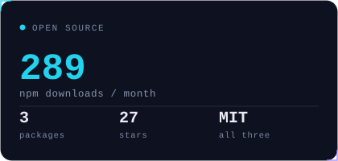
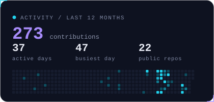
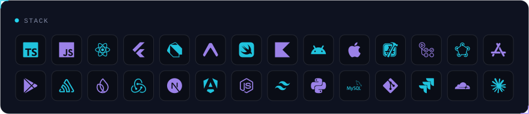
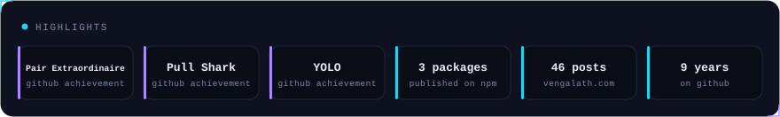

<picture>
  <source media="(prefers-color-scheme: dark)" srcset="assets/banner-dark.svg">
  <source media="(prefers-color-scheme: light)" srcset="assets/banner-light.svg">
  
</picture>

 

I build the guardrails that keep React Native releases from breaking.

Senior Software Engineer at [Zerone Consulting](https://www.zerone-consulting.com/), Kerala, India. Seven years shipping cross platform apps, most recently leading a React Native `0.73` to `0.82` New Architecture migration. The three tools below came out of that work: each one closes a gap where a mobile release usually goes wrong.

<picture>
  <source media="(prefers-color-scheme: dark)" srcset="assets/stats-dark.svg">
  <source media="(prefers-color-scheme: light)" srcset="assets/stats-light.svg">
  
</picture>
<picture>
  <source media="(prefers-color-scheme: dark)" srcset="assets/activity-dark.svg">
  <source media="(prefers-color-scheme: light)" srcset="assets/activity-light.svg">
  
</picture>

## The React Native release pipeline

Three published packages, one per stage. All MIT, all in production use.

<!--START:tools-->
#### Pre merge &nbsp;·&nbsp; [`react-native-doctor-ci`](https://github.com/AmrithVengalath/react-native-doctor-ci)

   

Policy as code CI gate for React Native dependency health. Fails the pull request and annotates the exact `package.json` lines that add an abandoned, non New Architecture, or npm deprecated dependency. Also ships as a GitHub Action. Emits SARIF.

#### Pre release &nbsp;·&nbsp; [`react-native-deeplink-devtools`](https://github.com/deeplink-devtools/react-native-deeplink-devtools)

   

The `rndl` CLI for React Native deep links. Inspects route tables, validates AASA and Android App Links, opens links on simulators and devices, and generates type safe link helpers. Runs locally or in CI.

#### Post release &nbsp;·&nbsp; [`react-native-release-health`](https://github.com/release-health/react-native-release-health)

   

Vendor neutral OTA rollout safety. Session tagging, update probation, crash loop detection, and rollback recommendations, so a bad over the air update is caught on device instead of in your reviews. Works with `expo-updates` and `hot-updater`.

<!--END:tools-->

## Stack

<picture>
  <source media="(prefers-color-scheme: dark)" srcset="assets/stack-dark.svg">
  <source media="(prefers-color-scheme: light)" srcset="assets/stack-light.svg">
  
</picture>

<picture>
  <source media="(prefers-color-scheme: dark)" srcset="assets/highlights-dark.svg">
  <source media="(prefers-color-scheme: light)" srcset="assets/highlights-light.svg">
  
</picture>

## Writing

<!--START:posts-->
| | |
| --- | --- |
| Jul 26, 2026 | [react-native-release-health: catching a bad OTA update before your users do](https://vengalath.com/blog/react-native-release-health-ota-rollout-safety/) |
| Jul 13, 2026 | [We ran rn-doctor on 20 popular React Native templates - here's what's dying inside them](https://vengalath.com/blog/we-ran-rn-doctor-on-20-popular-react-native-templates/) |
| Jul 12, 2026 | [Why universal links and Android App Links break (10 fixes)](https://vengalath.com/blog/why-universal-links-and-android-app-links-break/) |
| Apr 21, 2026 | [Seven years shipping cross-platform apps: what I actually learned](https://vengalath.com/blog/seven-years-shipping-cross-platform-apps-release-engineering-lessons/) |

46 posts and counting at [vengalath.com/blog](https://vengalath.com/blog/) · [RSS](https://vengalath.com/feed.xml)
<!--END:posts-->

## Track record

- Led a React Native `0.73` to `0.82` migration across nine versions, enabling the New Architecture with validated post migration stability.
- Cut crash rates and load times by 40% through targeted profiling and optimization across a wide range of devices.
- Automated builds, tests, and store deployments with Fastlane and GitHub Actions.
- Shipped same day hotfixes with CodePush OTA updates, with Sentry and Firebase Crashlytics reporting from production.
- Built gesture driven animations with Reanimated and custom native modules bridging iOS and Android.

<picture>
  <source media="(prefers-color-scheme: dark)" srcset="https://raw.githubusercontent.com/AmrithVengalath/AmrithVengalath/output/snake-dark.svg">
  <source media="(prefers-color-scheme: light)" srcset="https://raw.githubusercontent.com/AmrithVengalath/AmrithVengalath/output/snake.svg">
  
</picture>

  

[vengalath.com](https://vengalath.com) · [blog](https://vengalath.com/blog/) · [rss](https://vengalath.com/feed.xml) · [pgp](https://vengalath.com/gpg) · [amrith@vengalath.com](mailto:amrith@vengalath.com)

Every card and the post list regenerate daily from npm, the GitHub API, and my RSS feed. No numbers on this page are typed by hand. See <a href="scripts/refresh.mjs">scripts/refresh.mjs</a>.

